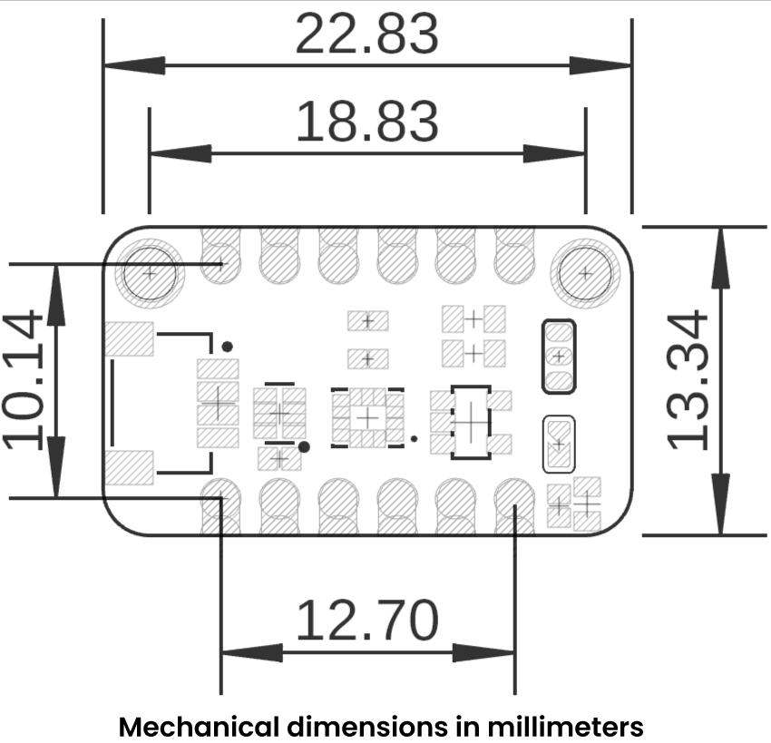

# Hardware

<a href="#">  Schematic</a>

## Pinout

<a href="#">  Pinout</a>

## Description

| Pin        | Label     | Description                                 | Typical Use                                                               |
|------------|-----------|---------------------------------------------|---------------------------------------------------------------------------|
| **OSDO**   | OSDO      | Oscillator Output / Crystal Pin (X2)        | Optional external clock output or crystal connection.                     |
| **OSC**    | OSC       | Oscillator Input / Crystal Pin (X1)         | Optional external clock input or resonator connection.                    |
| **INT2**   | INT2      | Interrupt 2 (polarity configurable)         | Generates interrupts for FIFO, step detection, etc.                       |
| **INT1**   | INT1      | Interrupt 1 (polarity configurable)         | Data-ready interrupt, motion detection, etc.                              |
| **AUX_SCL**| ASCX      | Auxiliary I²C clock (sensor-hub)            | Clock line for connecting external sensors (e.g. magnetometer).           |
| **AUX_SDA**| ASDX      | Auxiliary I²C data (sensor-hub)             | Data line for connecting external sensors (e.g. magnetometer).            |
| **CS**     | CS        | Chip-Select (SPI) – active LOW              | Selects the BMI270 when using SPI.                                        |
| **SDO**    | SDO       | SPI MISO / I²C-address select               | SPI: MISO data output. I²C: sets slave address (0→0x68, 1→0x69).       |
| **SCL**    | SCL       | I²C clock / SPI clock                       | Clock line for I²C or SPI bus.                                            |
| **SDA**    | SDA       | I²C data / SPI MOSI                         | Data line for I²C or MOSI in SPI.                                         |
| **VCC**    | VCC       | Power supply                                | Connect to 3.3 V                                                          |
| **GND**    | GND       | Ground                                      | Connect to system ground.                                                 |

---

## Interface-Selection Jumpers

- **I2C** → enables I²C mode (uses SDA + SCL).  
- **SPI3** → configures 3-wire SPI (CS + SCK + MOSI/SDO shared).  
- **SPI4** → configures 4-wire SPI (CS + SCK + MOSI + MISO).  
- **Pull ups** → connects onboard pull-up resistors on SDA/SCL (recommended for I²C).

---

## Dimensions

<a href="#">  Dimensions</a>

